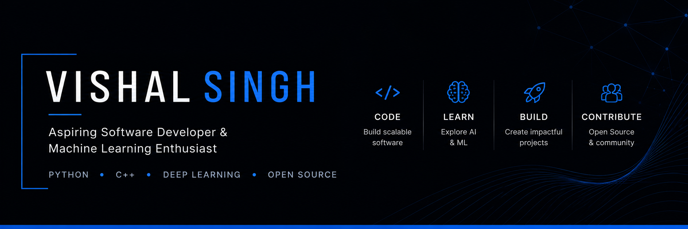

<p align="center">
  
</p>

<h1 align="center">
Hi 👋, I'm Vishal Singh
</h1>

<h3 align="center">
Aspiring Software Developer & Machine Learning Enthusiast
</h3>

<p align="center">
Building scalable software, intelligent AI systems, and impactful open-source projects.
</p>

<p align="center">

</p>


## 👨‍💻 About Me

```cpp
class VishalSingh {
public:
    string role = "Aspiring Software Developer";
    string focus = "Machine Learning & AI";

    vector<string> languages = {
        "Python", "C", "C++", "SQL"
    };

    vector<string> frameworks = {
        "PyTorch", "TensorFlow", "Scikit-learn", "NumPy", "Pandas", "Matplotlib", "Seaborn"
    };

    vector<string> currentlyWorkingOn = {
        "AI-powered Applications",
        "Open Source",
        "End-to-End ML Projects"
    };
};
```
## 🛠️ Tech Stack

<div align="center">

### Languages
<p>
  
</p>

### AI / Machine Learning
<p>
  
</p>

<p>
  
  
  
</p>

### Tools
<p>
  
</p>

</div>

## 📈 GitHub Analytics

<p align="center">
  
  
</p>

<p align="center">
  
</p>

## 📊 Contribution Activity

<p align="center">
  
</p>

## 🚀 Featured Projects

<table>
<tr>

<td width="50%">

### 🧠 6G Channel Estimation

Deep Learning framework for accurate CSI reconstruction in next-generation wireless communication systems.

**Tech Stack**

`PyTorch` `Python` `Deep Learning` `Attention` `CNN`

**Highlights**

- Residual Dense Multi-scale Network (RDMSNet)
- 5-Fold Cross Validation
- Benchmark Framework
- End-to-End Research Pipeline

<p align="center">
<a href="https://github.com/vishal-49/6G-Channel-Estimation">

</a>
</p>

</td>

<td width="50%">

### 📊 Olist Data Analysis

End-to-end data analytics project focused on business insights using SQL, Python and Power BI.

**Tech Stack**

`Python` `SQL` `Power BI` `Pandas`

**Highlights**

- Feature Engineering
- Exploratory Data Analysis
- Interactive Dashboard
- Business Insights

<p align="center">
<a href="https://github.com/vishal-49/Olist-Data-Analysis">

</a>
</p>

</td>

</tr>
</table>


## 🤝 Let's Connect

<p align="center">

<a href="https://linkedin.com/in/linkedin.com/in/vishal-singh-74009b38a">

</a>

<a href="mailto:vs4880489@gmail.com">

</a>

<a href="https://github.com/vishal-49">

</a>

</p>

---

<p align="center">

⭐ Thanks for visiting my profile!

If you like my work, consider giving a ⭐ to my repositories.

</p>
